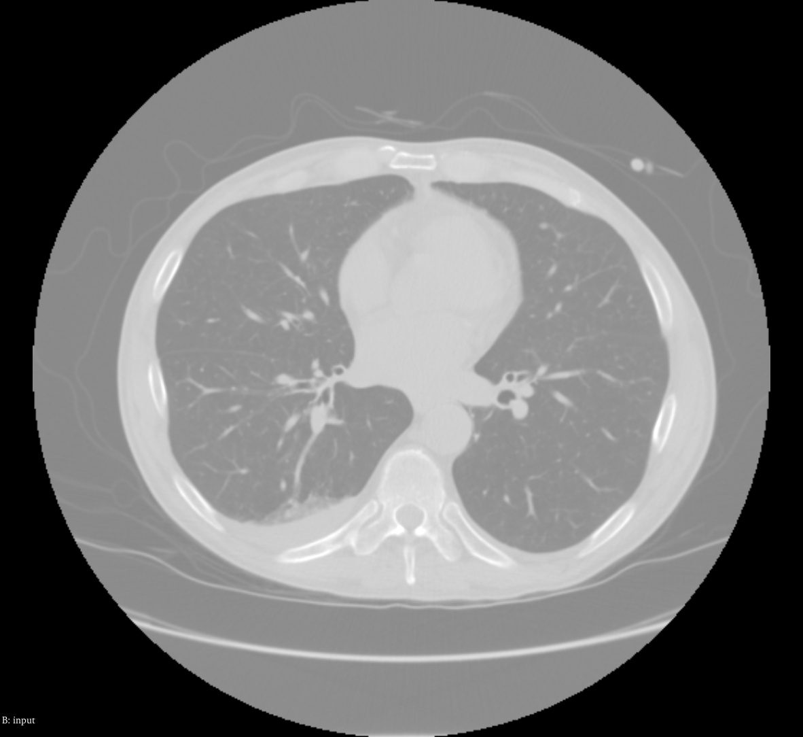
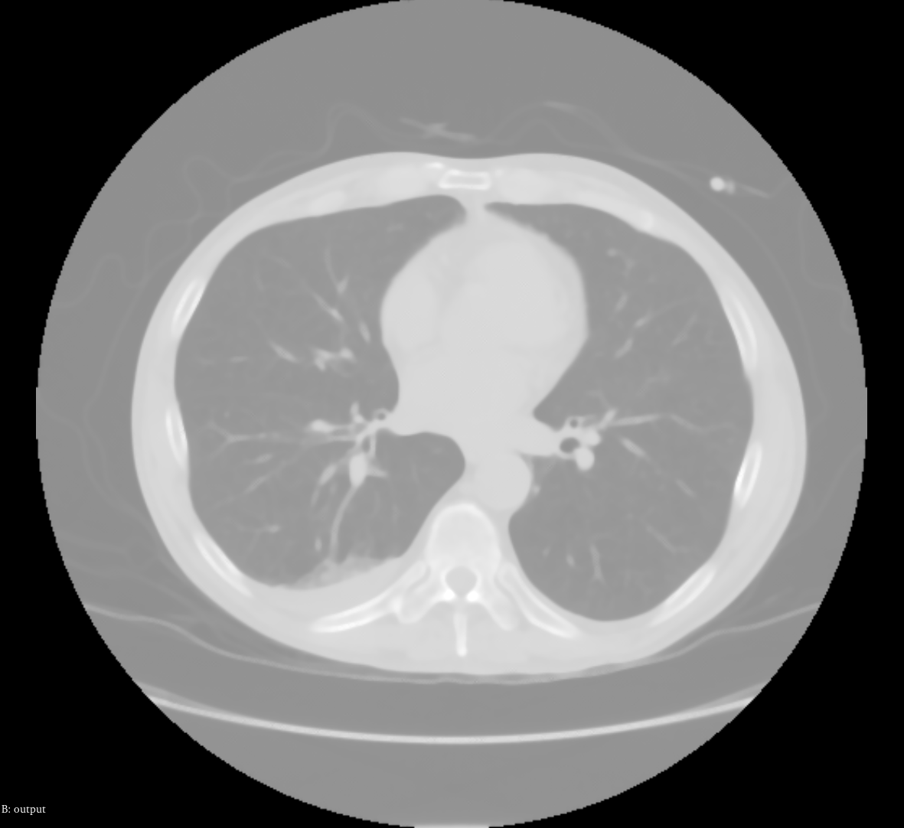

# CurvatureAD — Parameter Selection for Smoothing with Edge Preservation

## Overview

Curvature anisotropic diffusion applies diffusion along the iso-intensity
level sets (tangential direction) rather than isotropically. The update is
driven by mean curvature of the level set surface, making the filter
equivalent to mean-curvature motion. This produces a "cartoon" smoothing
effect: flat regions become very homogeneous while level-set boundaries
remain crisp.

## Comparison with GradientAD

| Property | GradientAD | CurvatureAD |
|----------|-----------|-------------|
| Diffusion direction | Isotropic within |Along level sets |
| Edge sharpness | Very good | Excellent |
| Interior smoothing | Good | Very good (more homogeneous) |
| Thin structure preservation | Moderate | Better |
| Computational cost | Similar | Similar |

CurvatureAD tends to produce cleaner, more uniform interior regions because
it smooths along edges rather than up to them. It is preferable when downstream
segmentation requires homogeneous regions.

## Parameters

The same three parameters (conductance, timeStep, iterations) apply as in
GradientAD, with identical stability constraints (dt ≤ 0.0625 for 3D).

**Conductance (K):**
- K = 1.0: Very strong edge preservation; minimal interior smoothing per step.
- K = 2.0–3.0: Good smoothing of noisy regions with sharp boundary retention.
- K = 5.0+: Edges soften; behavior approaches isotropic diffusion.

## Example

|              Input              | Gaussian AD (Conductance=5, Time Step=0.1, Iterations=5) | Curvature AD (Conductance=5, Time Step=0.1, Iterations=5) |
|:-------------------------------:|:--------------------------------------------------------:|----------------------------------------------------------|
|  |           |      |
