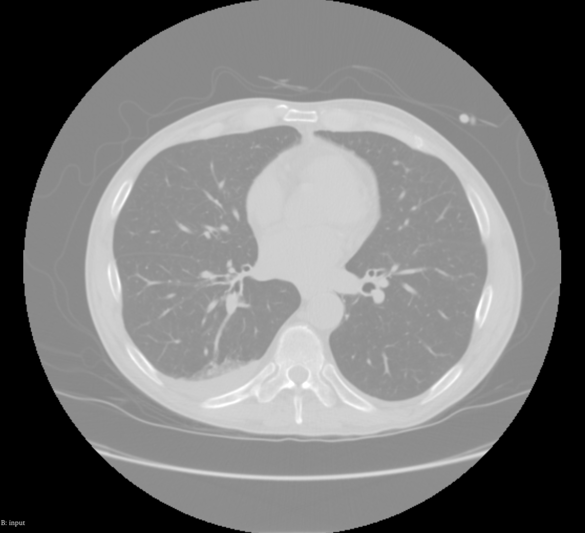
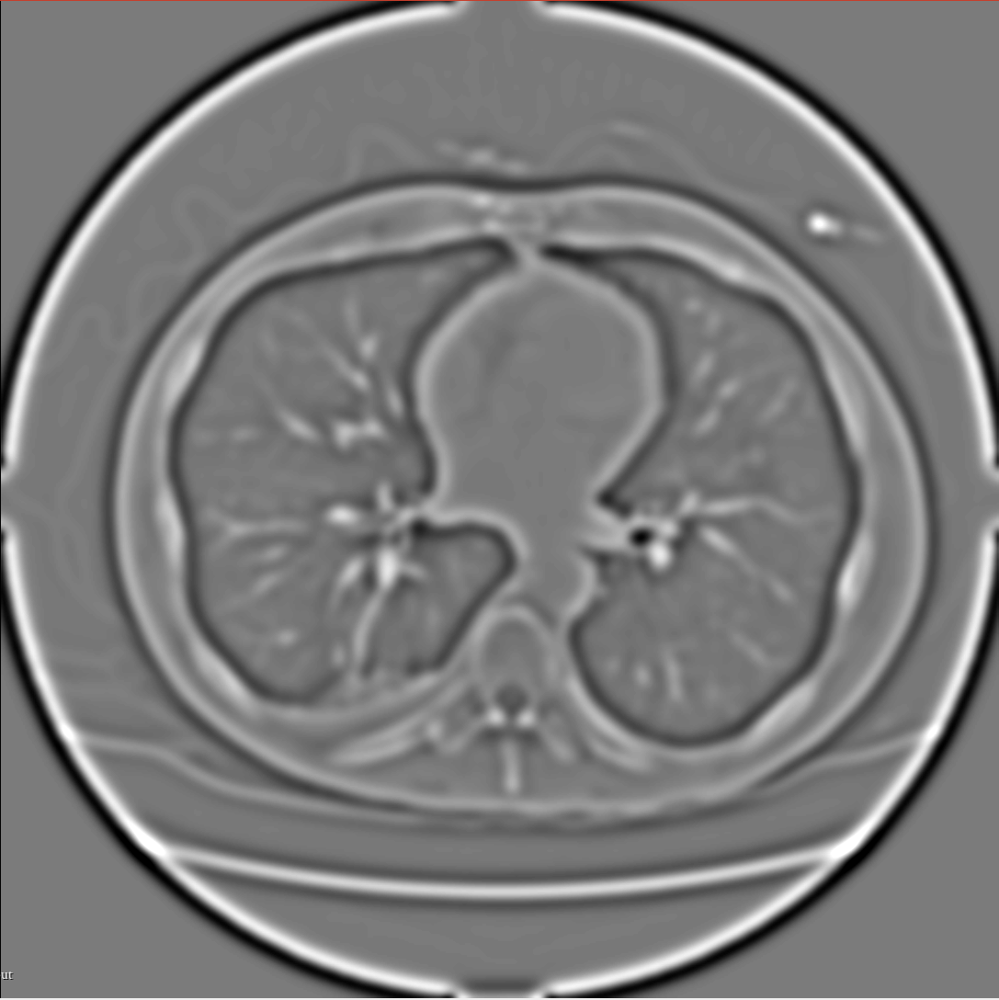

# DOG — Effect of σ1 and σ2 on Edge Response

## Overview

The Difference of Gaussians (DOG) filter approximates the Laplacian of Gaussian
(LoG) edge detector. It subtracts two smoothed versions of the image:

    DOG(f) = G_σ1(f) − G_σ2(f)

where σ1 < σ2 (typically). The output is rescaled to [0, 255] and stored as
unsigned char.

## How σ1 and σ2 Affect the Edge Response

**Scale of detected edges** is controlled primarily by σ2 − σ1. A large
difference (e.g., σ1 = 1.0, σ2 = 5.0) detects broad, low-frequency edges
corresponding to large anatomical boundaries (outer cortex, organ surfaces).
A small difference (e.g., σ1 = 1.0, σ2 = 2.0) detects fine, high-frequency
edges such as vessel walls or thin sulcal folds.

**Edge sharpness** is inversely related to σ1. Using a very small σ1 means the
first Gaussian removes little noise, so the DOG response includes both true edges
and noise-induced fluctuations. Increasing σ1 first pre-smooths the image,
yielding cleaner (but slightly broader) edge responses.

**Noise sensitivity** increases when σ1 is small. If the input image is noisy,
prefer σ1 ≥ 1.5 mm to avoid enhancing noise as edges.

## Conclusion

The DOG filter is useful for detecting edges at a specific spatial scale
determined by the ratio σ2/σ1. For a clean edge map, set σ1 large enough
to suppress noise and choose σ2 based on the minimum feature size of interest.

## Example

### My Side-by-Side Images Title

|              Input              |       DOG Output (Sigma1=2.5, Sigma2=3.5)       |
|:-------------------------------:|:-----------------------------------------------:|
|  |  |
