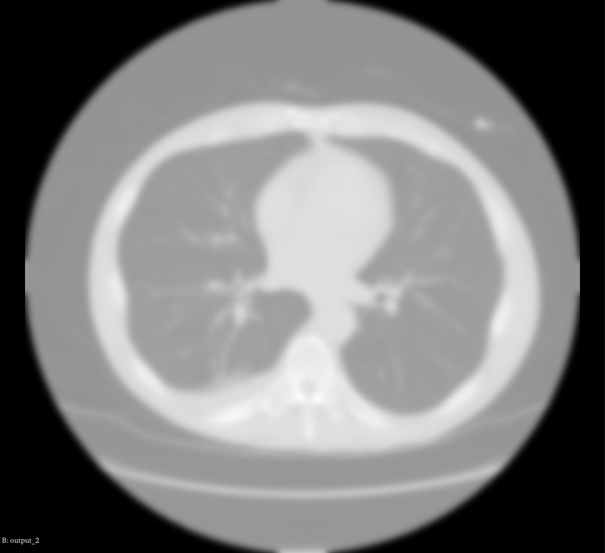

# GaussianLPF — Effect of σ on Smoothing and Resolution

## Overview

The Gaussian low-pass filter (LPF) convolves the image with a Gaussian kernel
of standard deviation σ in all three spatial directions. Increasing σ widens
the kernel, which changes the trade-off between noise reduction and edge sharpness.

## How σ Affects Smoothing

A small σ (e.g., 0.5–1.0 mm) produces only mild blurring. High-frequency noise
is slightly attenuated, but fine structural details and sharp tissue boundaries
remain clearly visible. The histogram of pixel values shows only a minor narrowing
compared to the unfiltered image.

A moderate σ (e.g., 1.5–3.0 mm) noticeably reduces Gaussian noise while
preserving most anatomical structures. MRI white-matter/grey-matter boundaries
and CT bone edges remain detectable, but thin structures (vessel walls, sulci)
begin to blur into their surroundings.

A large σ (e.g., 4.0 mm and above) strongly suppresses noise at the cost of
significant resolution loss. Fine anatomical features merge together, and the
effective spatial resolution of the image is degraded to roughly 2σ in physical
units. In brain MRI, individual gyri and sulci become indistinct; in CT, thin
cortical bone may appear thickened or partially erased.

## Trade-off Summary

| σ (mm) | Noise Reduction | Edge Sharpness | Recommended Use |
|--------|----------------|----------------|-----------------|
| 0.5    | Minimal        | Near-original  | Mild denoising |
| 1.5    | Moderate       | Good           | General pre-processing |
| 3.0    | Strong         | Reduced        | Feature extraction with large structures |
| 5.0+   | Very strong    | Poor           | Only coarse segmentation |

## Conclusion

The Gaussian LPF is a global, linear filter: it smooths everywhere equally
regardless of whether a pixel lies in a flat noise region or on a sharp edge.
For applications that require edge preservation (e.g., segmentation), an
anisotropic filter (GradientAD or CurvatureAD) is preferable for larger
smoothing amounts.

## Example

|              Input              |         Gaussian LPF Output (Sigma=2.5)         |
|:-------------------------------:|:-----------------------------------------------:|
|  |  |
